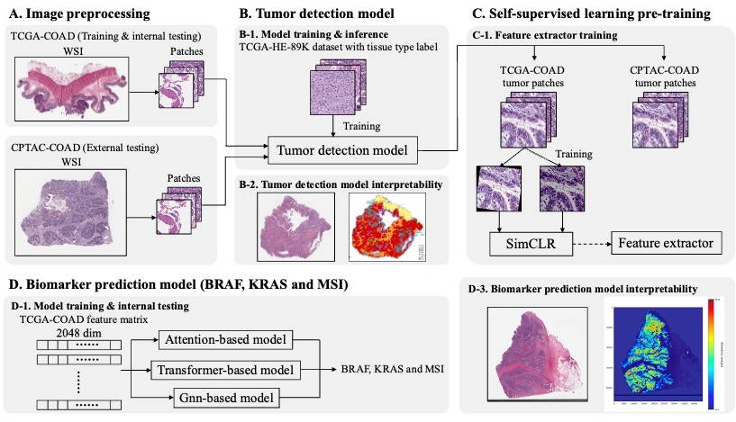
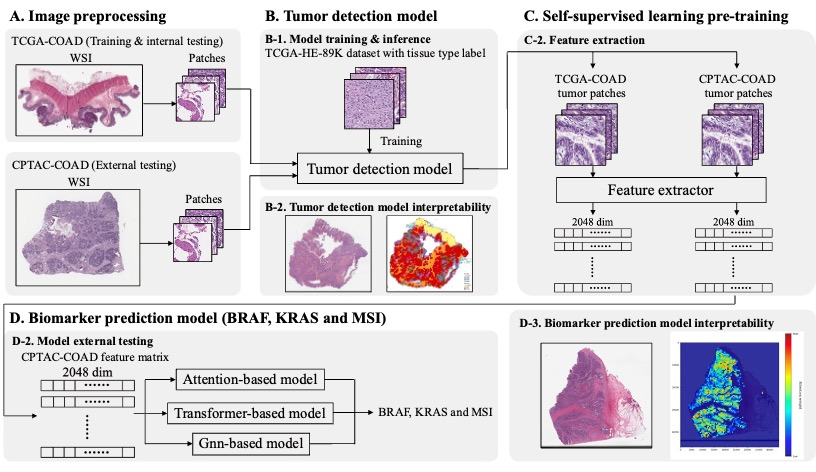

# Prediction of generalizable biomarker from colorectal adenocarcinoma whole slide images via integrated deep learning pipeline
Construct the integrated deep learning pipeline to predict BRAF, KRAS and MSI directly from pathological images in colorectal cancer
## Pipeline
## Stage 1: feature extractor training

## Stage 2: biomarker prediction model training and internal testing

## Stage 3: biomarker prediction model external testing

## Prerequisites
* Operating system: CentOS 7.8
* Programmimg language: Python 3, sh
* Hardware: NVIDIA Tesla V100-PCIE-32GB
## Data download
### WSI & biomarker label
* Download `TCGA-COAD` whole slide images from [GDC portal](https://portal.gdc.cancer.gov) for model training and internal testing.
* Download `CPTAC-COAD` whole slide images from [CIP Cancer Imaging Program](https://www.cancerimagingarchive.net/collection/cptac-coad/) for model external testing.
* Download corresponding biomarker label data for TCGA-COAD and CPTAC-COAD from [cBioPortal](https://www.cbioportal.org).
### Patch-level tissue category dataset
* Download `TCGA-HE-89K` dataset from [here](https://zenodo.org/records/4024676) for tumor detection model training.
## Installation
### clone this repository:
```bash
git clone https://github.com/chenh2lab/TGY_2023
cd TGY_2023
```
### setup environment:
* `PyHIST.yml` is for image preprocessing (patch generation)
* `PyTorch.yml` is for DL model training
```bash
cd envs
conda env create -f PyHIST.yml
conda env create -f PyTorch.yml
```
## Image preprocessing
Cut single WSI into 512 * 512 pixels patches.
```bash
sh ./image_preprocessing/patch_generation/pyhist.sh
```
## Tumor detection model
Use `TCGA-HE-89K` dataset to train a VGG19-based tumor detection model to classify tumor patches from all of the patches in WSI.
